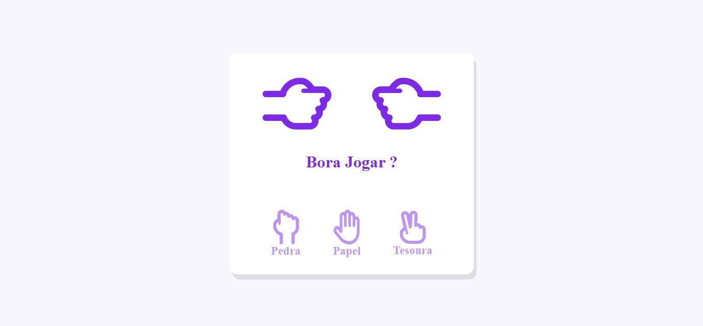

# ✊✋✌️ Jokenpô – Aplicação Front-End

Aplicação Front-End de Jokenpô (Pedra, Papel e Tesoura), desenvolvida com HTML, CSS e JavaScript, com foco em lógica de programação, manipulação do DOM e interatividade com o usuário.

## 🖥️ Demonstração
🔗 Site online: https://jokenpo-silk.vercel.app/  
🔗 Repositório: https://github.com/mellacer/Jokenpo
## 📸 Preview


## 🛠️ Tecnologias
- HTML5
- CSS3
- JavaScript

## ✨ Destaques
- Lógica de jogo baseada em regras condicionais
- Geração de jogadas aleatórias para o computador
- Manipulação dinâmica do DOM para atualização de resultados
- Feedback visual durante a execução da rodada
- Interface responsiva para diferentes tamanhos de tela


## 📚 Objetivo
Projeto desenvolvido com fins educacionais, com foco no aprimoramento de:
- Estruturação de lógica em JavaScript
- Uso de eventos e interação com o usuário
- Manipulação de estados visuais
- Organização de código e clareza de regras de negócio


## 📱 Responsividade
A interface se adapta a diferentes dispositivos, garantindo boa usabilidade tanto em desktop quanto em mobile.

## 🚀 Execução do Projeto
```bash
# Clone o repositório
git clone https://github.com/mellacer/Jokenpo

# Acesse a pasta
cd Jokenpo

# Abra o index.html no navegador
